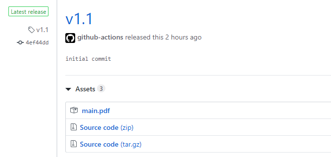

# Latex CI Template (GitHub Actions)

## Features

- push commits to build `main.tex` (`ipsj_v4` format)
- push tags to release `main.pdf`

## Usage

(Requirement: [GitHub Actions](https://github.com/features/actions))
1. Fork this repository
2. modify files as you wish (configured for `ipsj_v4` format by default)
3. Push commits to automatically build `main.tex`, and push tags to release generated PDF (`main.pdf`)

## Configurations

- latex config ([.latexmkrc](.latexmkrc))
- GitHub Actions workflow ([.github/workflows/buildPDF.yml](.github/workflows/buildPDF.yml))

## References

- https://www.ipsj.or.jp/journal/submit/style.html (ipsj_v4)
- https://github.com/Paperist/docker-alpine-texlive-ja (docker image for latex build)
- https://github.com/s4ichi/latex-template (.latexmk)
- https://github.com/marketplace/actions/gh-release (GitHub Action for release PDF)
